# Self-Defending Cloud Network

## What is this?
This project is a smart, self-defending computer network built in the cloud (using AWS). 

Normally, if a hacker or a bot tries to break into a system, a security team gets an alert and has to manually block them. This project automates that entire process. It acts like an automatic digital bouncer: it sets a trap, watches for bad behavior, and instantly kicks attackers out without any human help.

---

## How It Works (The Blueprint)

 

---
This system is built using four main steps:

### 1. The Bait (The Trap)
We set up a normal-looking server (a computer in the cloud) and purposely leave its "front door" wide open. This acts as a trap to attract automated bots and hackers who are scanning the internet for easy targets.

### 2. The Watchdog (The Alarm)
We turn on a smart security camera for our network (AWS GuardDuty). It watches all the traffic coming in and out. It is smart enough to know the difference between normal visitors and an attacker trying to scan our system or guess passwords. 

### 3. The Quick Response (The Brains)
As soon as the Watchdog spots an attacker, it triggers an instant alarm. This alarm wakes up a small piece of custom code (a Python script). This script's only job is to quickly grab the exact IP address (the digital location) of the attacker.

### 4. The Shield (The Block)
Once the script has the attacker's IP address, it immediately updates our network's main firewall. It creates a custom rule that permanently blocks that specific attacker from ever talking to our network again.

